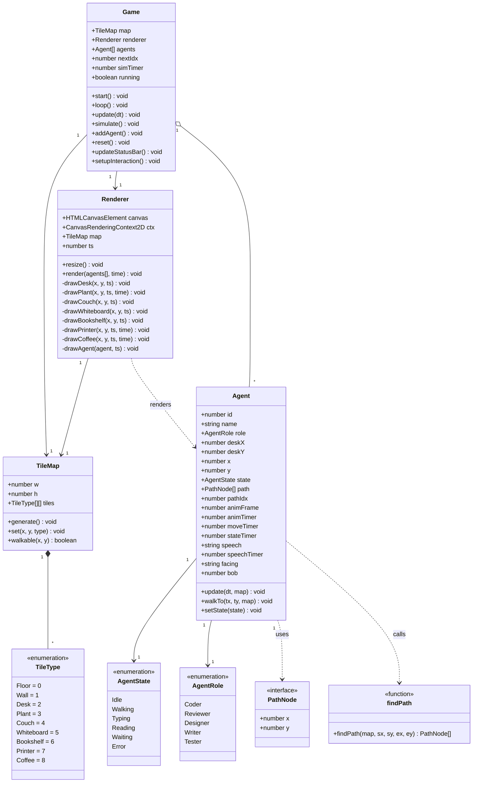
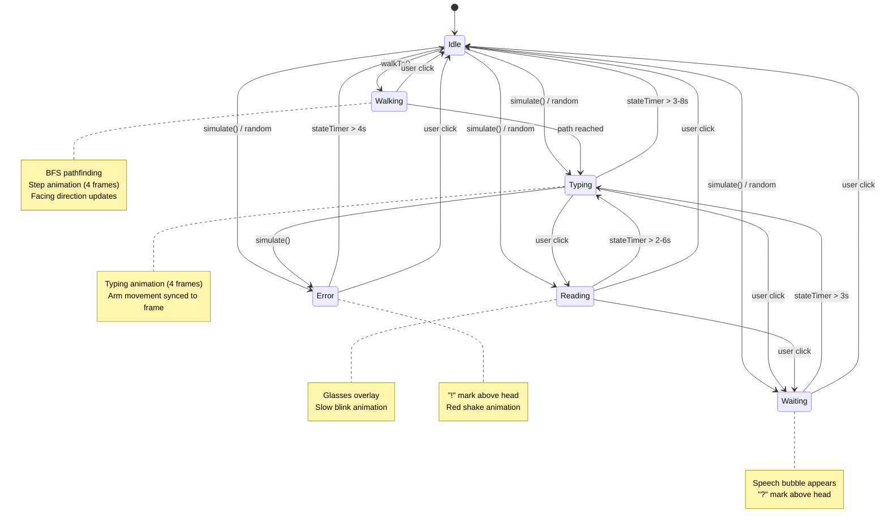
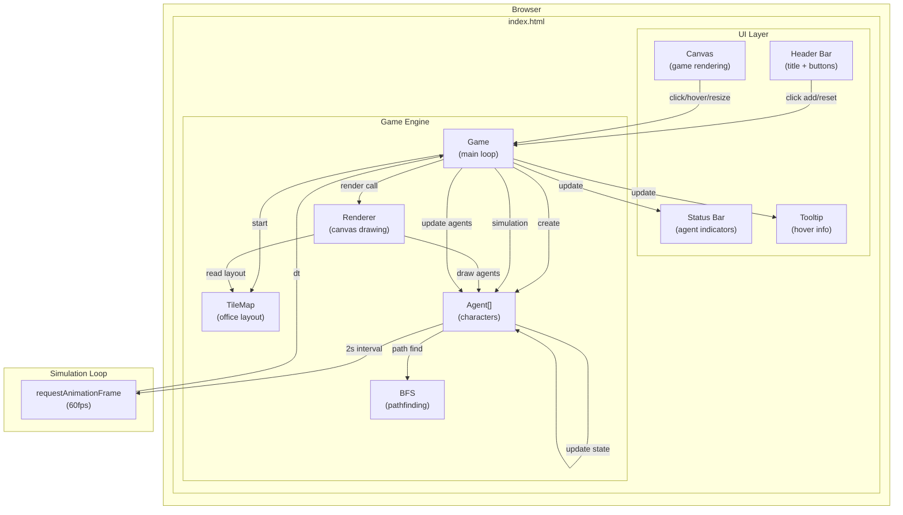
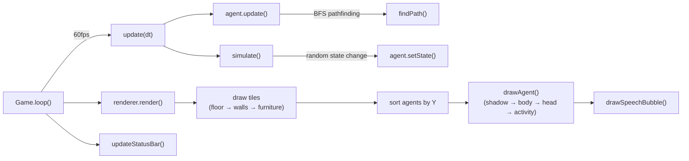
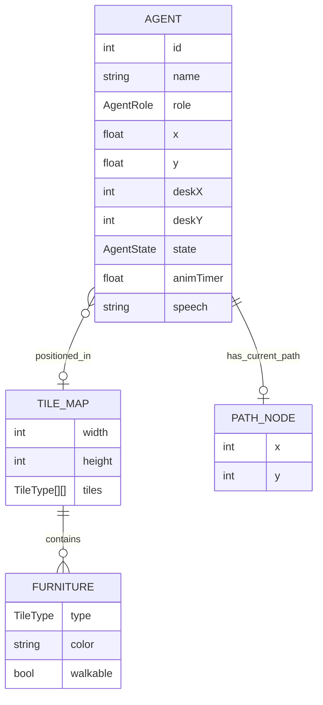
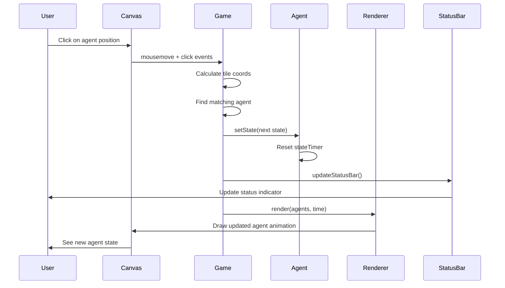

# Pixel Agents MVP — UML 文档

## 1. 类图 (Class Diagram)

## 2. Agent 状态机 (State Machine)

## 3. 组件图 (Component Diagram)

## 4. 渲染流程 (Render Pipeline)

## 5. 数据结构 (Data Structures)

## 6. 交互序列图 (Interaction - Click Agent)

